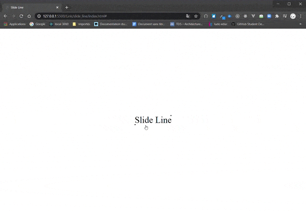

# My_snippets_stack
>*Bibliothèque de snippets CSS, js ...*

>*❗ reset css sur chaque html !!*

<ul>

    1 - Link :

        A - Slide Line : 
        
        B - 
        c -

    2 -

        A -
        B -

</ul>
        
